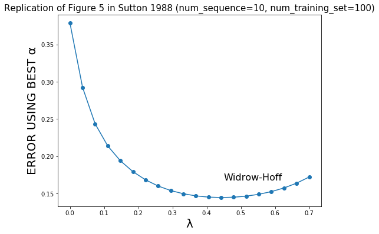

# OMSCS-CS-7642: Reinforcement Learning
## language used: Python
## HW2
TD learning algorithm 
## Project 1
Replication of the random walk experiment in paper entitled __*Learning to Predict by the Methods of Temporal Differences*__ by Sutton 1988   
   
   
